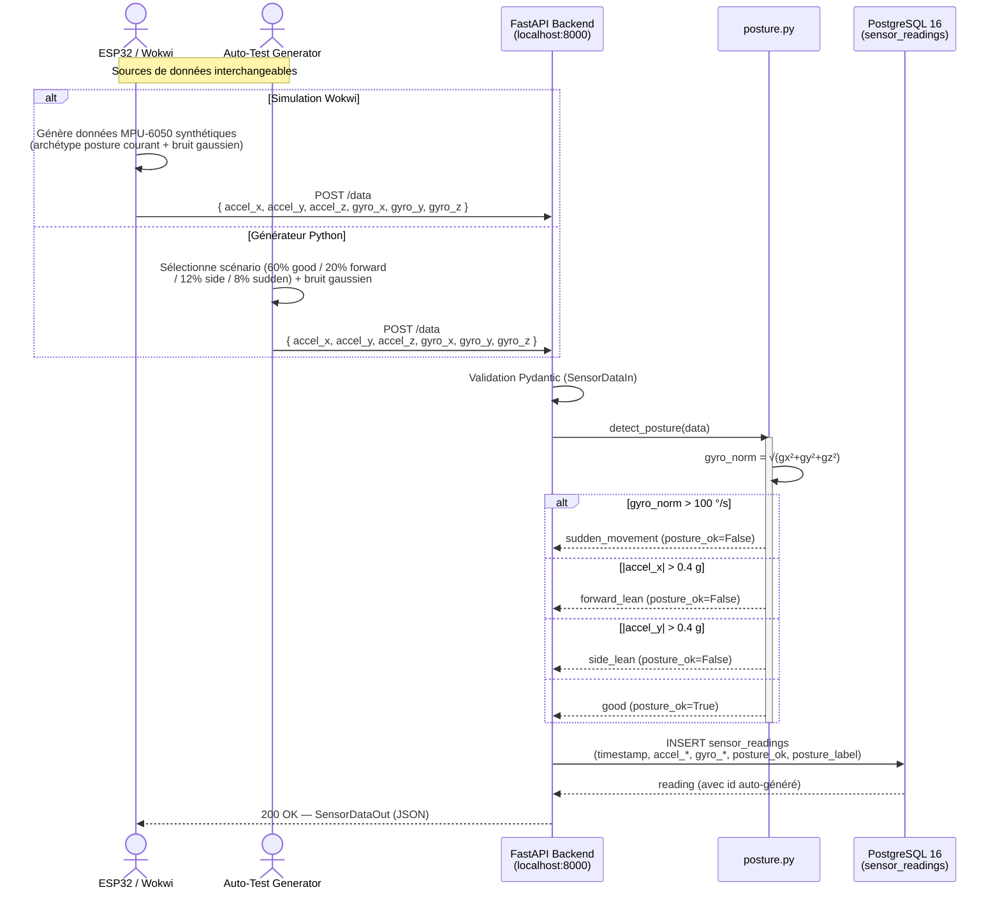
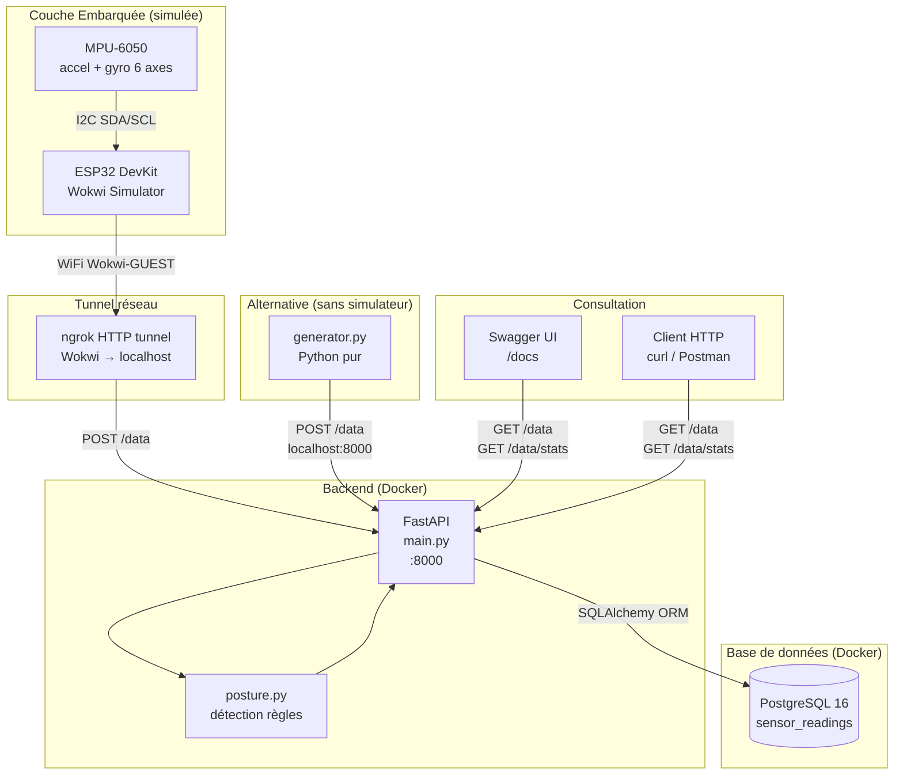
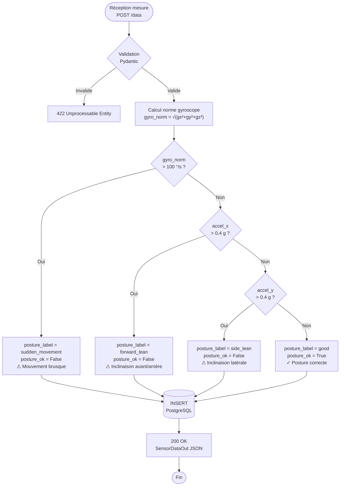

# Diagrammes de flux de données — SmartPosture

## 1. Diagramme de séquence — Cycle de vie d'une mesure capteur

---

## 2. Diagramme d'architecture — Vue composants

---

## 3. Diagramme d'activité — Algorithme de détection de posture

