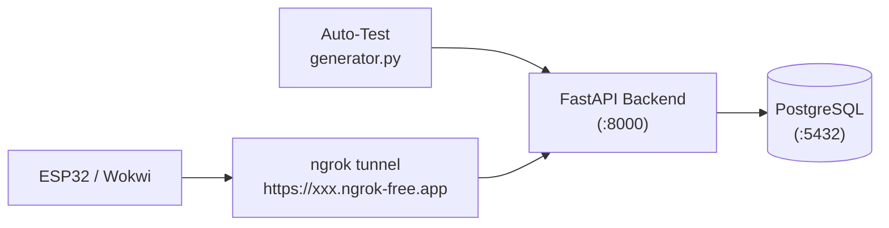

# Diagramme de flux de données — SmartPosture

```mermaid
flowchart LR
    ESP["ESP32 / Wokwi"] --> NGROK["ngrok tunnel\nhttps://xxx.ngrok-free.app"]
    GEN["Auto-Test\ngenerator.py"] --> API

    NGROK --> API["FastAPI Backend\n(:8000)"]
    API --> DB[("PostgreSQL\n(:5432)")]
```
